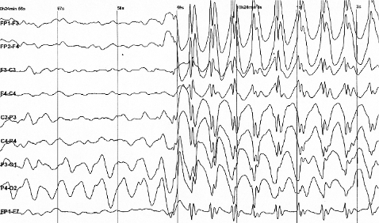
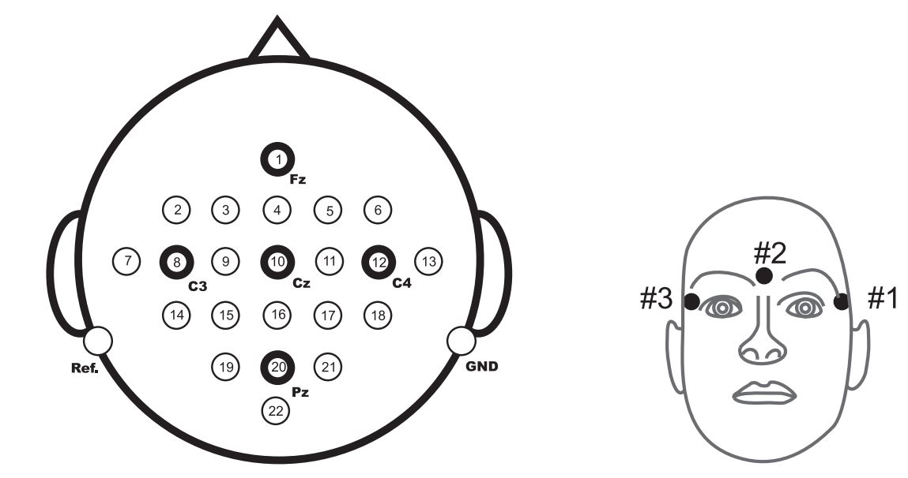
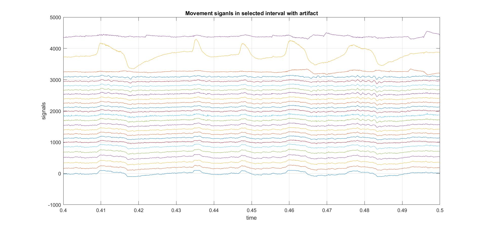
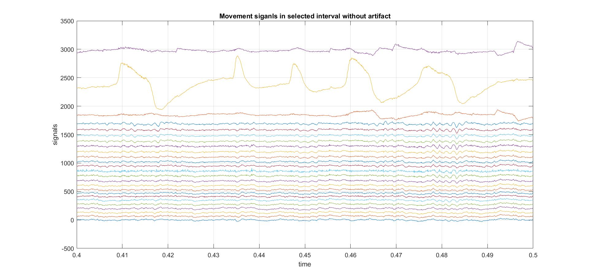
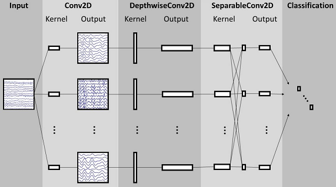

# EEG-Motor-Imagery-Analysis
This repository belongs to my implementations during my **B.Sc. Project**. The main title was _Applications of Deep Neural Networks in EEG Signal Analysis_.

My project was finished in June 2021. Afterwards, I learned much more about deep learning programming. So, the code that I put here is the revised and cleaned version of my original code.

## Introduction

Electroencephalography (EEG) is an electrophysiological monitoring method to record electrical activity on the scalp. As one can guess, the change in brain activity is manifested in EEG signal. The below image shows the EEG signal before and after an epileptic seizure happens in someone's brain.

<figure>
    
    <figcaption align="center"> Epileptic spike and wave discharges [<a href="https://en.wikipedia.org/wiki/Electroencephalography" target="_blank">source</a>] </figcaption>
</figure>

The obtained signal usually has an amplitude in $\mu V$ range and $ms$ time resolution. The fundamental features of the signal lie in $0.1-100Hz$ in frequency domain. EEG has a wide variety of applications in:

- **Epilepsy** (like detection and prediction of epileptic seizures)
- **Brain-Computer Interfaces** (like motor imagery EEG, P300 spellers, etc.)
- **Sleep Studies** (like classification of sleep stages)
- **Monitoring** (like emotion recognition, drowsiness and mind wandering detection, etc.)

Signal processing and machine learning methods can help specialists correctly interpret EEG. There are several challenges in EEG processing like non-stationary nature, inter-subject variability, low SNR, etc. In the past years deep neural networks have been exploited to tackle problems in EEG processing. These models have shown better performances than classic EEG analysis methods.

My first task in this project was to do a comprehensive **article review** on DL-EEG papers published in the past few years. Hence, I reviewed 51 articles in different EEG domains. Several characteristics in were studied in each papers such as **application domain**, **NN structures in the paper**, **publicity of utilized datasets**, etc.

After doing my first task, public datasets and top approaches were identified. The second task was to implement and modify highlighted articles. I decided to work on **motor imagery** EEG signals because they seemed more challenging and had richer literature compared to other EEG areas.

I did preprocessing steps using `numpy` and `scipy`. Deep learning models and their training were implemented using `pytorch`.

## Dataset [[bcic]](#1)

The dataset we used is [BCI Competition IV 2a](http://www.bbci.de/competition/iv/). This dataset is recorded from 9 subjects while doing 4 different motor imagery tasks. Each subjects data contains two sessions (train and test) which were recorded on two different days. Each session contains 288 4-second motor imagery tasks (except train session of subject 4 that contains 192). 

The signals were obtained using 22 Ag/AgCl electrodes for EEG, sampled in $250Hz$ rate and bandpass-filtered in $0.5-100Hz$. At the beginning of each session an approximately 5-minutes recording was performed to estimate the effect of EOG signals (there are also 3 EOG channels). The location of the electrodes is shown in the below figure:

<figure>
    
    <figcaption align="center"> Electrode locations </figcaption>
</figure>

## Preprocessing

The functions for downloading the dataset, extracting subject data, and doing the preprocessing steps are gathered in `datautils.py`.

### EOG Removal

The first step of preprocessing is to remove EOG artifacts. Based on [[schlogl]](#2), the received signal in each EEG electrode is considered as the sum of real signal and a linear combination of EOG electrodes. The coefficients this linear combinations are calculated for each EEG channel and for each EOG channel. Finally, we have a 66 coefficients that we use for EOG removal. The below equation is used for the process:
$$
b=C_{NN}^{-1}.C_{NY}
$$
where $C_{NN}$ is the autocovariance matrix of EOG data, $C_{NY}$ is cross-covariance matrix of EEG and EOG data.

The following equation is used to remove noise in 4-second MI tasks:
$$
S=Y-N.b
$$
Where $S$ is actual EEG data, $Y$ is noisy EEG, and $N$ is EOG data.

The effect of EOG removal in a selected interval is illustrated in the two following figures. The upper three signals are EOG channels and the others are EEG. As you can see, the effect of EOG peaks in EEG signals is omitted in the second figure.

<figure>
    
</figure>

<figure>
    
</figure>

### Bandpass Filter

Bandpass filtering is performed using a sixth order Butterworth bandpass filter with low cut of $4Hz$ and high cut of $38Hz$. This choice is because of the fact that motor imagery features generally happen in alpha and beta band of EEG.

### Channel Normalization

Each channel is normalized using its own mean and standard deviation (namely _Z-score normalization_). This can be done during data extraction using the function `mat_extractor` in `datautils.py`.

###  Data Augmentation

Since the dataset does not have enough data to train a deep neural network, we crop the signals using sliding windows with specific step and size. The size of the window is 500 samples (2 seconds; like the articles in the literature). Smaller step means more data. We can change our training size by adjusting the step of this sliding window. Two approaches may come up here:

1. Crop the signals and make a training dataset before the training process
   - This approach may encounter memory problems when setting small steps.
2. Crop a batch of signals during each update of the networks parameters.
   - This approach fixes the memory problem. However, the same process of batch extraction in every epoch may considerably increase our training time.

Both approaches are implemented and corresponding train functions (`train` and `cropped_train`) are in `fitting.py`.

## Models

### EEGNet [[lawhern]](#3)

This model is a compact, yet effective model for classification of BCI signals. Four types of BCI signals were analyzed in the main paper. But we only examined motor imagery EEG.

I the original paper the signals were resampled to $128Hz$ (to be able to use the same network for different BCI paradigms). However, we used the $250Hz$ sampling rate of the dataset.

A conceptual illustration of the architecture from the paper is given below:

<figure>
    
    <figcaption align="center"> EEGNet visualization </figcaption>
</figure>

We defined DepthwiseConv2D and SeperableConv2D layers using predefined `torch` layer `Conv2D`. Additionally, there is a norm constraint on the weights of Conv2D and fully connected layer. So, we defined the layers `Conv2dConstrained` and `LinearConstrained`. I learned a lot from examples of `braindecode` library for this and later models.

### Shallow/Deep ConvNet [[schir]](#4)

These structures are from one of the most inspiring articles in motor imagery EEG domain.

Shallow ConvNet is designed based on the CSP method (the use of log and square as activation functions reflects this fact).

Deep ConvNet is a bigger network with more parameters. Therefore, for better training we need to use a smaller step for out data augmentation.

## References

<a id="1">[bcic]</a> Tangermann et al. (2012), **Review of the BCI competition IV**, *Frontiers in Neuroscience*, vol. 6, p. 55

<a id="2">[schlogl] </a>Schlogl et al. (2007), **A fully automated correction method of EOG artifacts in EEG recordings**, *Clinical Neurophysiology*, vol. 118, p. 98

 <a id="3">[lawhern] </a> Lawhern et al. (2018), **EEGNet: A Compact Convolutional Neural Network for EEG-based Brain-Computer Interfaces**, *Journal of Neural Engineering*, vol. 15, p. 13

<a id="4">[schir] </a> Schirrmeister et al. (2017), **Deep Learning with Convolutional Neural Networks for EEG Decoding and Visualization**, *Human Brain Mapping*, vol. 38, p. 5391
